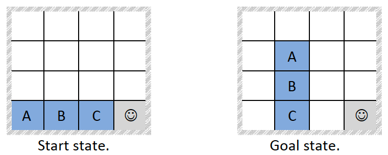

# Evaluating Search Methods using Blocksworld Tile Puzzle
This repository contains the code and the [report](report.pdf) for solving Blocksworld Tile Puzzle using various search methods. This is done as part of the Artificial Intelligence coursework at the University of Southampton.

## Blocksworld Tile Puzzle
An agent moves in a simulated NxN grid world with the goal of building towers of blocks. Each grid space contains either a tile or the agent. Some tiles have letters on them – these are the ‘blocks’. All the other tiles are white. The agent moves up/down/left/right except where borders prevent it. Given the start state, the goal is to build a tower according to the goal state.

<p align="center">
	
</p>

## Algorithms
- Breadth-first search
- Depth-first search
- Depth-limited search
- Iterative deepening depth-first search
- A* search using Manhattan distance as heuristic

## Usage
```
python Search.py
```